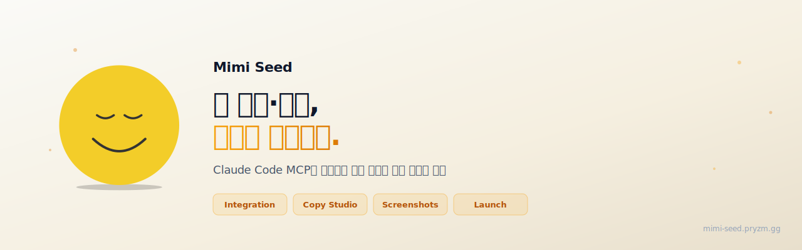

<p align="center">
  
</p>

<p align="center">
  <a href="https://mimi-seed.pryzm.gg"><strong>🌐 Web Console</strong></a> &nbsp;·&nbsp;
  <a href="https://mimi-seed.pryzm.gg/workspace/api-tokens">🔑 Get API Token</a> &nbsp;·&nbsp;
  <a href="https://www.npmjs.com/package/@yoonion/mimi-seed-mcp">📦 npm</a> &nbsp;·&nbsp;
  <a href="README.ko.md">🇰🇷 한국어</a>
</p>

<p align="center">
  <a href="https://www.npmjs.com/package/mimi-seed"></a>
  <a href="https://www.npmjs.com/package/@yoonion/mimi-seed-mcp"></a>
  <a href="LICENSE"></a>
</p>

---

How many tabs do you have open right now to ship one app?

Play Console · App Store Connect · Firebase · AdMob · Google Cloud IAM...  
Write release notes, check screenshot specs, reply to reviews, wire up Firebase — all in separate dashboards, all manual.

**Mimi Seed handles all of this through Claude Code conversation.**

```
"Is my app ready to ship?"
→ Readiness Score 87/100 · 2 blockers: missing 6.9" screenshots, What's New empty

"Write release notes from commits since the last tag, Korean and English, and push to Play Store"
→ 3 tones (concise / detailed / marketing) × 2 locales generated · Apply now?

"Reply to this 1-star review with an empathetic tone"
→ Draft ready · Review before posting?

"Add an Android app to Firebase and download google-services.json"
→ App created · Add SHA-1 fingerprint?
```

---

## 30-Second Setup

**Option A — Remote MCP** (Recommended · requires web console account)

```bash
# 1. Create account: https://mimi-seed.pryzm.gg
# 2. Issue a PAT:   https://mimi-seed.pryzm.gg/workspace/api-tokens
# 3. Register in Claude Code:
claude mcp add --transport http mimi-seed https://mimi-seed.pryzm.gg/api/mcp \
  --header "Authorization: Bearer <PAT>"
```

Done. Start talking to Claude Code.

---

**Option B — Local MCP** (Google OAuth · runs on your machine)

```bash
# Claude Code
claude mcp add mimi-seed -- npx -y @yoonion/mimi-seed-mcp

# First-time auth (opens browser)
npx -y @yoonion/mimi-seed-mcp mimi-seed-auth
```

Claude Desktop (`claude_desktop_config.json`):

```json
{
  "mcpServers": {
    "mimi-seed": {
      "command": "npx",
      "args": ["-y", "@yoonion/mimi-seed-mcp"]
    }
  }
}
```

Optional auth for more platforms:

```bash
npx -y @yoonion/mimi-seed-mcp mimi-seed-appstore-auth    # App Store Connect
npx -y @yoonion/mimi-seed-mcp mimi-seed-playstore-auth   # Play Store service account
npx -y @yoonion/mimi-seed-mcp mimi-seed-bigquery-auth    # BigQuery (Crashlytics export, etc.)
```

Enable AI features (release notes, review replies):

```bash
export ANTHROPIC_API_KEY=sk-ant-...
```

---

**Option C — CLI project connect**

```bash
npx mimi-seed init   # auto-detect app → connect account → register MCP
```

Detects Expo · Gradle · Info.plist · pbxproj automatically, and drops a `.claude/mimi-seed.md` so Claude Code picks up the release workflow every session.

| Command | What it does |
|---------|--------------|
| `mimi-seed init` | Connect project (issue PAT + auto-register apps) |
| `mimi-seed status` | Connection status + app list |
| `mimi-seed auth` | Google OAuth (Firebase / AdMob / Play) — `login` / `status` / `refresh` / `logout` |
| `mimi-seed doctor` | Diagnose environment (token · Git · apps · CI) |
| `mimi-seed check` | Pre-release readiness check (score + blockers) |
| `mimi-seed notes` | AI release notes (git log → 3 tones → multi-locale → apply) |
| `mimi-seed review` | AI review-reply draft + post to Play Store |
| `mimi-seed deploy` | Full deploy pipeline (CI build → release notes → store) |
| `mimi-seed logout` | Remove local config |

---

## What Can It Do?

### Launch Readiness Check

Automatically scans your Play Store and App Store listings before release.

```
"What's missing before I can ship?"
```

- Listing completeness (title, description, keywords)
- Screenshot device coverage
- Build availability (internal track / TestFlight)
- Privacy policy, What's New

---

### AI Release Notes

git commits → user-friendly release notes → push to stores.

```
"Write release notes from commits since v2.1.0 in Korean and English, then apply to Play Store"
```

- 3 tones: concise / detailed / marketing
- Multiple locales in one shot (ko · en-US · ja · zh-TW …)
- Generate → review → apply in one flow

---

### AI Review Replies

```
"Reply to this 2-star review with a professional tone"
```

Tones: `friendly` · `professional` · `empathetic` · `brief`  
Post directly with `playstore_reply_to_review` after review.

> AI-generated replies are drafts. Always review before posting.

---

### Screenshot Spec Validation

Validate local files against store requirements before uploading.

```
"Do these screenshots meet the iPhone 6.9-inch spec?"
```

iOS: `APP_IPHONE_69` · `APP_IPHONE_67` · `APP_IPAD_PRO_3GEN_129`  
Android: `phoneScreenshots` · `sevenInchScreenshots` · `featureGraphic`

---

### Firebase & AdMob Automation

```
"Add Android and iOS apps to my-app project and download both config files"
"Create a banner ad unit"
"What's today's AdMob revenue?"
```

---

### Service Account End-to-End

Need a service account JSON for Play Store receipt verification on your server?

```
"Create a play-verifier service account in my-project and issue a JSON key"
```

Creates IAM account → issues key → walks you through Play Console permissions.

---

### One-Command Deploy

Drive the whole release from one command: CI build → blocker check → release notes → store apply.

```bash
npx mimi-seed deploy                          # Android, auto-detect CI
npx mimi-seed deploy --platform ios           # iOS
npx mimi-seed deploy --skip-build --version-code 142   # notes-only apply
```

Works with **Jenkins · GitHub Actions · GitLab CI** (auto-detected, or force with `--ci`).

---

## Slash Commands (MCP Prompts)

Available in any MCP client (Claude Code, etc.) as native slash commands:

| Command | What it does |
|---------|--------------|
| `/mimi-seed:deploy` | Check blockers → generate release notes → apply to stores |
| `/mimi-seed:health` | Auth status + launch readiness summary |
| `/mimi-seed:review-inbox` | Fetch unanswered reviews → draft AI replies |

Plus MCP resources: `mimi-seed://auth/status` (token state) · `mimi-seed://agent/guide` (agent role definition).

---

## Tool List (110+)

| Domain | Count | Key Tools |
|--------|-------|-----------|
| **App Store Connect** | 30 | `appstore_submit_for_review` · `appstore_upload_screenshot` · `appstore_update_whats_new` |
| **Google Play** | 26 | `playstore_submit_release` · `playstore_replace_images` · `playstore_reply_review` |
| **Firebase** | 17 | `firebase_create_android_app` · `firebase_get_android_config` · `firebase_enable_service` |
| **AdMob** | 7 | `admob_create_ad_unit` · `admob_get_today_earnings` · `admob_get_report` |
| **CI/CD** | 6 | `ci_trigger_build` · `ci_get_build_status` · `ci_list_workflows` (GitHub Actions · GitLab) |
| **Facebook** | 6 | `facebook_post_photo` · `facebook_post_multi_photo` · `facebook_list_pages` |
| **Google Cloud IAM** | 5 | `iam_create_service_account` · `iam_create_key` · `iam_add_iam_policy_binding` |
| **BigQuery** | 5 | `bigquery_run_query` · `bigquery_list_datasets` · `bigquery_get_table_schema` |
| **Checks / Risk** | 4 | `playstore_check_submission_risks` · `appstore_check_submission_risks` · `screenshot_validate` · `release_status` |
| **Instagram** | 4 | `instagram_post_image` · `instagram_post_carousel` · `instagram_save_config` |
| **AI** | 2 | `generate_release_notes_from_commits` · `generate_review_reply` |
| **Auth** | 2 | `mimi_seed_auth_start` · `mimi_seed_auth_status` |

Full list → [packages/mcp-server](packages/mcp-server)

---

## CI/CD Integration

Auto-generate and apply release notes on tag push:

```yaml
- name: Generate and apply release notes
  env:
    MIMI_SEED_TOKEN: ${{ secrets.MIMI_SEED_TOKEN }}
    ANTHROPIC_API_KEY: ${{ secrets.ANTHROPIC_API_KEY }}
  run: |
    npx mimi-seed notes --apply --no-interactive --locale ko,en-US
    npx mimi-seed check --fail-on-blocker
```

Issue `MIMI_SEED_TOKEN` at [Dashboard → API Tokens](https://mimi-seed.pryzm.gg/workspace/api-tokens).

---

## Packages

| Package | Description |
|---------|-------------|
| [`mimi-seed`](packages/cli) | CLI — `npx mimi-seed init` to connect your project |
| [`@yoonion/mimi-seed-mcp`](packages/mcp-server) | Local MCP — 110+ tools via Google OAuth |

Web console (Remote MCP): [mimi-seed.pryzm.gg](https://mimi-seed.pryzm.gg)

---

## Environment Variables

| Variable | Description |
|----------|-------------|
| `MIMI_SEED_TOKEN` | PAT for CLI / CI headless mode |
| `MIMI_SEED_WEB_BASE` | Server base URL (default: `https://mimi-seed.pryzm.gg`) |
| `ANTHROPIC_API_KEY` | Enable AI release notes and review replies (optional) |

---

## Legacy Compatibility

Data from the Preseed era (`~/.preseed/`) is picked up automatically — no re-auth needed.

- Reads `~/.preseed/tokens.json` and `~/.preseed/appstore.json` if present
- Still honors `PRESEED_GOOGLE_CLIENT_ID` / `PRESEED_GOOGLE_CLIENT_SECRET`

New data is written to `~/.mimi-seed/`.

---

## License

[PolyForm Noncommercial License 1.0.0](LICENSE) — noncommercial use only.

Commercial licensing: [mimi-seed.pryzm.gg](https://mimi-seed.pryzm.gg)

**Required Notice:** Copyright 2026 Pryzm GG (https://mimi-seed.pryzm.gg)
